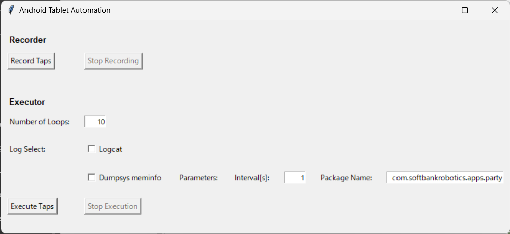

# Android タブレット操作自動化プログラム

このプログラムは、Android タブレット上での操作を自動化するためのツールです。具体的には、タップ操作を記録して再生する機能を提供します。このドキュメントでは、環境構築方法やツールの使い方について説明します。

## 必要な環境

- Python 3.x がインストールされていること
-  adb (Android Debug Bridge) がインストールされていること


## インストール手順

1. このリポジトリをダウンロードまたはクローンします。
2. Python 3.x がインストールされていない場合は、[Python公式サイト](https://www.python.org/downloads/)からダウンロードしてインストールします。パスを通すことを忘れないでください。

    参考となるサイトを紹介します。
    - [Windows](https://qiita.com/umashikate/items/a612378f8eeb50d8dcfe)
   - [Mac](https://pepenoheya.blog/python-environment-construction-mac-recommended/)
  
  
    インストールできているか確認します。次のコマンドを実行してPythonのバージョンが3.xであることを確認してください。
     ```
     python -V
     ```
3. Android タブレットに `adb` がインストールされていない場合は、[Android Developersサイト](https://developer.android.com/studio/command-line/adb)からダウンロードしてインストールします。パスを通すことを忘れないでください。
    参考となるサイトを紹介します。
    - [Windows](https://sp7pc.com/google/android/34263#GeneratedCaptionsTabForHeroSec)
    - [Mac](https://sp7pc.com/google/android/17843)

    インストールできている確認します。次のコマンドを実行してadbのバージョンが表示されることを確認してください。
    ```
    adb version
    ```


## 使い方
1. `adb`を使用してPepperに接続します。
　  
    ```bash
    adb connect <PepperのIP アドレス>
    ```
2. コマンドラインやターミナルでプログラムのディレクトリに移動します。
3. 次のコマンドを入力してプログラムを実行します。

    ```bash
    python main.py
    ```

4. プログラムが起動すると次の操作画面が表示されます。各機能について説明します。
    

   - **Recorder(タップ操作の記録)**

     Recorderはタップ操作の記録を行います。次の手順で操作します。
     1. まず、アプリを開いて、ループを行う最初の画面まで移動します。
     2. 「Record Taps」ボタンをクリックします。
     3. ファイル保存ダイアログが表示されるので、保存先とファイル名を指定します。
     4. タップ操作を記録が開始されます。1.のループの開始画面までタップ操作を行ってください。
     
     ※ループ終了画面のタップからループ開始画面戻るときの時間差は現在ここの開始するタイミングにより調整されます。例えば、ループ終了画面のタップからループ開始画面のタップができるまで1秒間、間がある場合は最初のタップ操作を記録するタイミングを1秒間ずらしてください。
     5. タップ操作が完了した、または中断したい場合は、「Stop Recording」ボタンをクリックします。

   - **Executor(タップ操作の再生)**
   　Executorは記録したタップ操作の再生を行います。次の手順で操作します。
     1. 「Number of Loops」はループする回数です。任意の自然数を入力してください。
     2. Log Selectは実行中に取得したいLogのコマンドを選ぶところです。必要なコマンドがあれば選択してください。
     
        Logは`Log`というディレクトリ内に、選択するタップ操作を記録したファイル名をディレクトリ名として保存されます。例えば`test_recoder.csv`というタップ操作を記録したファイルを選択し場合は`Log/test_recoder`内に各コマンドのLogが保存されます。（同じ名前のディレクトリがある場合は「_{数字}」が付きます）
        - 「Logcat」は`adb logcat`が実行されます。`logcat.txt`として保存されます。
        - 「Dumpsys meminfo」は`adb shell dumpsys meminfo ${package_name}`が実行されます。Parameterの「interval」は`adb shell dumpsys meminfo ${package_name}`が何秒ごとに実行されるかを設定するところです。デフォルトは1となっています。「Package Name」は`adb shell dumpsys meminfo ${package_name}`の`${package_name}`を指定するところです。現在デフォルトは`com.softbankrobotics.apps.party`となっています。
     3. アプリを開いて、ループを行う最初の画面まで移動します。
     4. 「Execute Taps」ボタンをクリックします。
     5. クリックするとファイル選択を要求されるため実行するタップ操作が記録されたファイルを選択します。
     6. 自動操作が開始されます。タブレットには触らないでください。コマンドラインまたはターミナルにはループ回数と、tapが実行する時刻とtapのx,y座標が表示されます。
     7. 自動操作を中断したい場合は「Stop Execute」ボタンをクリックします。
   
   - **プログラムの終了**
     - 画面の左上にある×を押してください
     - もし終了しなければターミナルで「ctrl-c」または「cmd-c」を押してください。
     - それでも終了しなければターミナルを閉じてください。
　

## 注意事項
- PCとPepperは同一LAN内においてください。
- 自動操作が実行されている間は、Pepperのタブレットに触らないでください。
- 実行中にエラーが発生した場合は、エラーメッセージを確認してください。

## 動作確認
- Windows 11,  Python 3.10,  adb 1.0.41